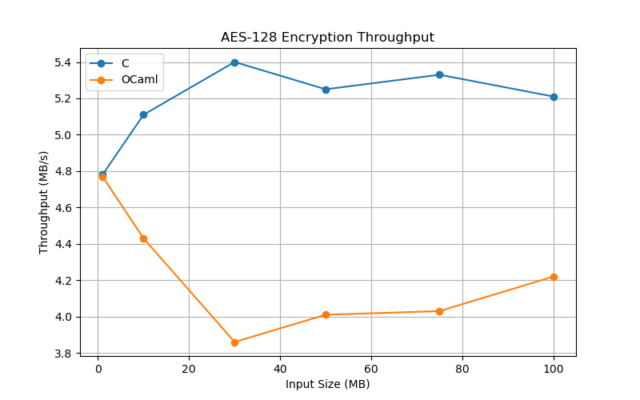
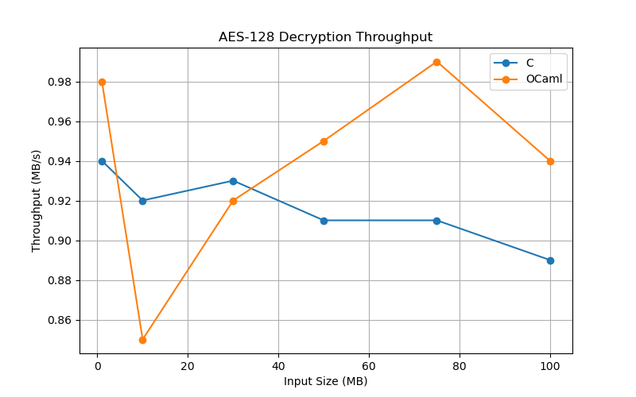
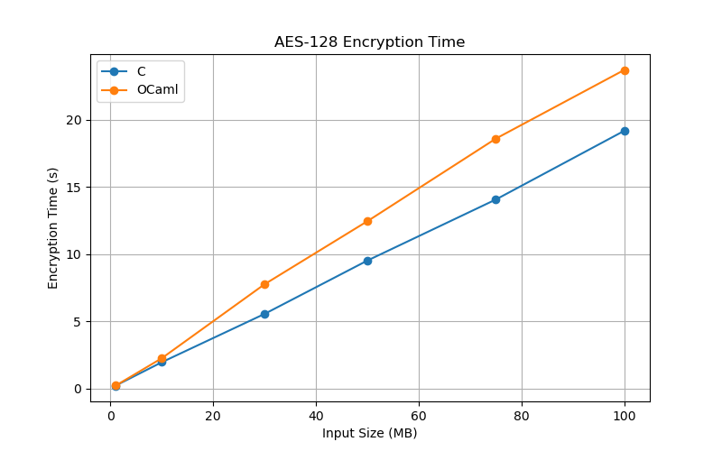
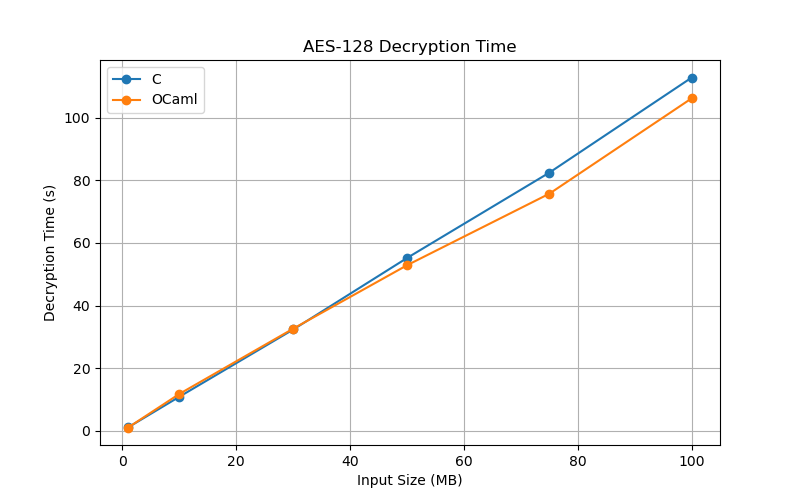

# AES-128 Benchmark Results

## Test Environment

Two implementations of AES-128 were benchmarked:

* C Implementation
* OCaml Implementation

Input sizes tested:

* 1 MB
* 10 MB
* 30 MB
* 50 MB
* 75 MB
* 100 MB

Metrics measured:

* Encryption Time
* Decryption Time
* Encryption Throughput
* Decryption Throughput

---

## C Results

| Size (MB) | Enc Time (s) | Dec Time (s) | Enc Speed (MB/s) | Dec Speed (MB/s) |
| --------- | ------------ | ------------ | ---------------- | ---------------- |
| 1         | 0.209164     | 1.067206     | 4.78             | 0.94             |
| 10        | 1.956014     | 10.864503    | 5.11             | 0.92             |
| 30        | 5.553893     | 32.353192    | 5.40             | 0.93             |
| 50        | 9.524956     | 55.226519    | 5.25             | 0.91             |
| 75        | 14.071440    | 82.517157    | 5.33             | 0.91             |
| 100       | 19.190375    | 112.897013   | 5.21             | 0.89             |

---

## OCaml Results

| Size (MB) | Enc Time (s) | Dec Time (s) | Enc Speed (MB/s) | Dec Speed (MB/s) |
| --------- | ------------ | ------------ | ---------------- | ---------------- |
| 1         | 0.209562     | 1.021215     | 4.77             | 0.98             |
| 10        | 2.255228     | 11.765928    | 4.43             | 0.85             |
| 30        | 7.764979     | 32.627074    | 3.86             | 0.92             |
| 50        | 12.455560    | 52.904959    | 4.01             | 0.95             |
| 75        | 18.606154    | 75.780856    | 4.03             | 0.99             |
| 100       | 23.721564    | 106.268691   | 4.22             | 0.94             |

---

## Performance Comparison

### Encryption Throughput

| Size (MB) | C    | OCaml |
| --------- | ---- | ----- |
| 1         | 4.78 | 4.77  |
| 10        | 5.11 | 4.43  |
| 30        | 5.40 | 3.86  |
| 50        | 5.25 | 4.01  |
| 75        | 5.33 | 4.03  |
| 100       | 5.21 | 4.22  |

### Decryption Throughput

| Size (MB) | C    | OCaml |
| --------- | ---- | ----- |
| 1         | 0.94 | 0.98  |
| 10        | 0.92 | 0.85  |
| 30        | 0.93 | 0.92  |
| 50        | 0.91 | 0.95  |
| 75        | 0.91 | 0.99  |
| 100       | 0.89 | 0.94  |

---

## Observations

1. The C implementation consistently achieved higher encryption throughput than the OCaml implementation.

2. Encryption throughput remained relatively stable across increasing input sizes for both implementations.

3. Decryption throughput was significantly lower than encryption throughput in both implementations.

4. The OCaml implementation exhibited performance close to the C implementation despite being implemented in a higher-level language.

5. Both implementations successfully passed all verification checks.

---

## Conclusion

The C implementation provided the best overall encryption performance, averaging approximately 5 MB/s. The OCaml implementation achieved approximately 4 MB/s encryption throughput while maintaining comparable decryption performance. Both implementations demonstrated correct AES-128 functionality and scalable performance across input sizes ranging from 1 MB to 100 MB.

## Graphs

The following graphs were generated from the benchmark results to compare the performance of the C and OCaml AES-128 implementations.

### Encryption Throughput



This graph compares the encryption throughput (MB/s) of the C and OCaml implementations across all tested input sizes.

### Decryption Throughput



This graph compares the decryption throughput (MB/s) of the C and OCaml implementations across all tested input sizes.

### Encryption Time



This graph shows the encryption time required by the C and OCaml implementations for input sizes ranging from 1 MB to 100 MB.

### Decryption Time



This graph shows the decryption time required by the C and OCaml implementations for input sizes ranging from 1 MB to 100 MB.

### Graph Files

```text
benchmarks/results/
├── encryption_speed_comparison.png
├── decryption_speed_comparison.png
├── encryption_time_comparison.png
└── decryption_time_comparison.png
```
