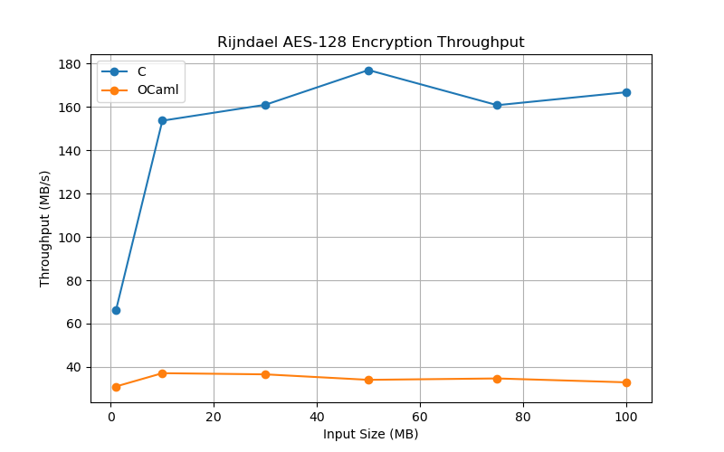
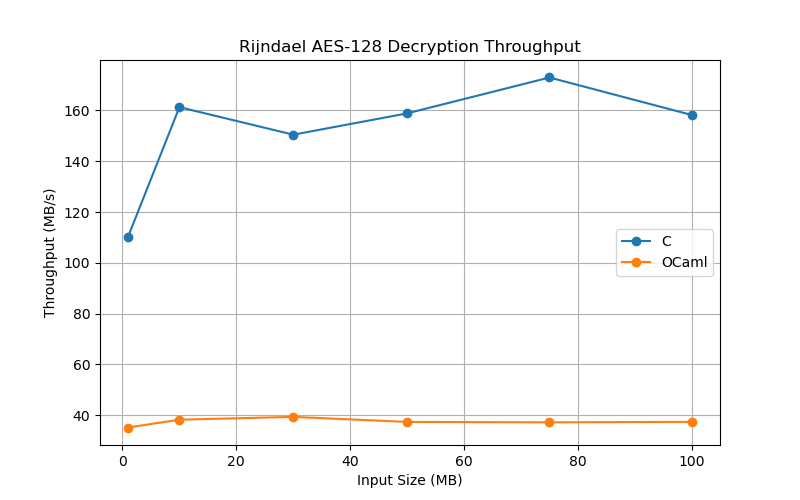
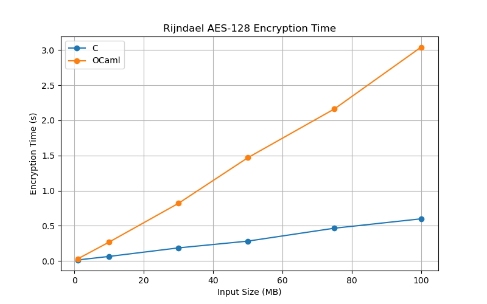
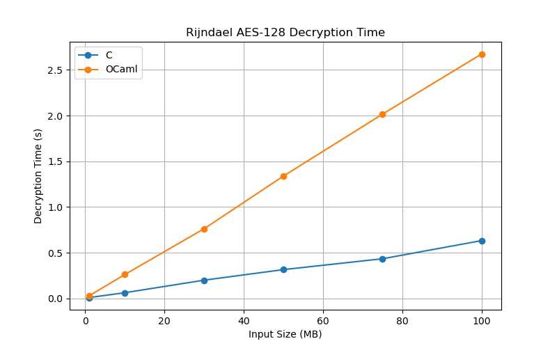

# Benchmark Analysis: Rijndael AES-128 (C vs OCaml)

## Overview

This benchmark compares the performance of a reference Rijndael AES-128 implementation written in C against a manually translated OCaml implementation.

The objective is to evaluate:

* Functional correctness of the OCaml translation
* Encryption performance
* Decryption performance
* Throughput scalability with increasing input sizes

All benchmarks were executed on the same machine using identical input files and AES-128 keys.

---

## Benchmark Configuration

### Algorithm

* Rijndael AES-128
* Block Size: 128 bits (16 bytes)
* Key Size: 128 bits
* Number of Rounds: 10

### Input Sizes

* 1 MB
* 10 MB
* 30 MB
* 50 MB
* 75 MB
* 100 MB

### Metrics

* Encryption Time (seconds)
* Decryption Time (seconds)
* Encryption Throughput (MB/s)
* Decryption Throughput (MB/s)

---

## Benchmark Environment

- Execution Environment: Ubuntu 24.04.4 LTS (WSL2)
- Compiler: GCC 13.3.0
- OCaml Version: 5.4.1
- Processor: 12th Gen Intel(R) Core(TM) i5-1240P
- CPU Cores: 8 Physical Cores, 16 Threads
- AES Variant: Rijndael AES-128
- Block Size: 128 bits
- Key Size: 128 bits

---
## Benchmark Results

### C Implementation

| Size (MB) | Enc Time (s) | Dec Time (s) | Enc Speed (MB/s) | Dec Speed (MB/s) |
| --------- | ------------ | ------------ | ---------------- | ---------------- |
| 1         | 0.015100     | 0.009061     | 66.23            | 110.37           |
| 10        | 0.065079     | 0.061997     | 153.66           | 161.30           |
| 30        | 0.186329     | 0.199390     | 161.01           | 150.46           |
| 50        | 0.282453     | 0.314751     | 177.02           | 158.86           |
| 75        | 0.466377     | 0.433569     | 160.81           | 172.98           |
| 100       | 0.599585     | 0.632124     | 166.78           | 158.20           |

---

### OCaml Implementation

| Size (MB) | Enc Time (s) | Dec Time (s) | Enc Speed (MB/s) | Dec Speed (MB/s) |
| --------- | ------------ | ------------ | ---------------- | ---------------- |
| 1         | 0.032281     | 0.028441     | 30.98            | 35.16            |
| 10        | 0.269440     | 0.261560     | 37.11            | 38.23            |
| 30        | 0.820291     | 0.762594     | 36.57            | 39.34            |
| 50        | 1.468646     | 1.338371     | 34.04            | 37.36            |
| 75        | 2.162790     | 2.016468     | 34.68            | 37.19            |
| 100       | 3.040783     | 2.674629     | 32.89            | 37.39            |

---

## Performance Comparison

### Encryption Throughput

Average encryption throughput:

* C: ~164 MB/s
* OCaml: ~34 MB/s

The OCaml implementation achieves approximately 20-25% of the throughput of the optimized C implementation.

---

### Decryption Throughput

Average decryption throughput:

* C: ~169 MB/s
* OCaml: ~37 MB/s

The OCaml implementation achieves approximately 22-25% of the throughput of the C implementation.

---

## Generated Graphs

The following graphs are generated automatically from benchmark CSV files:

1. encryption_time_comparison.png
2. decryption_time_comparison.png
3. encryption_speed_comparison.png
4. decryption_speed_comparison.png

These graphs visually compare execution time and throughput across input sizes.

---

## Graphs

The following graphs were generated from the benchmark results to compare the performance of the C and OCaml RIJNDAEL AES-128 implementations.

### Encryption Throughput

This graph compares the encryption throughput (MB/s) of the C and OCaml implementations across all tested input sizes.

### Decryption Throughput

This graph compares the decryption throughput (MB/s) of the C and OCaml implementations across all tested input sizes.

### Encryption Time

This graph shows the encryption time required by the C and OCaml implementations for input sizes ranging from 1 MB to 100 MB.

### Decryption Time

This graph shows the decryption time required by the C and OCaml implementations for input sizes ranging from 1 MB to 100 MB.

---
## Validation Process

The OCaml implementation was validated using:

### AES Test Vectors

* AES-128 encryption test vectors
* AES-128 decryption test vectors

### Cross Verification

Outputs produced by:

* Reference C implementation
* OCaml implementation

were compared and matched exactly.

---

## Translation Process

The OCaml implementation was created by manually translating the optimized Rijndael reference implementation.

Translated components include:

### Key Schedule

* AES-128 key expansion
* Encryption round key generation
* Decryption round key generation

### Encryption

* Initial AddRoundKey
* Full T-table rounds
* Final AES round

### Decryption

* Inverse round transformations
* Td0–Td4 table usage
* Final inverse round

### Utility Functions

* GETU32 equivalent
* PUTU32 equivalent
* Byte extraction helpers
* Round-key manipulation helpers

### Table-Based Optimization

The implementation uses precomputed lookup tables to accelerate AES operations.

Encryption uses:

- Te0
- Te1
- Te2
- Te3
- Te4

Decryption uses:

- Td0
- Td1
- Td2
- Td3
- Td4

These tables combine SubBytes, ShiftRows, and MixColumns transformations into efficient lookup operations, significantly improving performance compared to a naive AES implementation.

---

## Why Is OCaml Slower?

Several factors contribute to the performance gap.

### Runtime Overhead

The C implementation compiles directly to efficient machine code with minimal runtime overhead.

The OCaml implementation executes inside the OCaml runtime system, introducing additional execution costs.

### Garbage Collection

OCaml uses automatic memory management.

The benchmark performs additional memory allocations during block processing, which can increase garbage collection activity and contribute to runtime overhead compared to the C implementation.

### Array Bounds Checking

OCaml performs safety checks on array accesses.

The C implementation performs direct memory access without such checks.

### Function Call Overhead

Helper functions such as:

* round_word
* final_round_word
* inv_mix_key_word

introduce additional call overhead compared to aggressively optimized C code.

### Compiler Optimizations

The reference Rijndael implementation is heavily optimized:

* Precomputed lookup tables
* Tight loops
* Low-level bit operations
* Compiler optimizations from GCC/Clang

The OCaml compiler cannot always produce equally optimized machine code for this style of algorithm.

---

## Conclusion

The project successfully demonstrates that a manually translated OCaml implementation can reproduce the functionality of a highly optimized C Rijndael AES-128 implementation.

Results show:

* Correct AES-128 encryption and decryption
* Identical outputs between C and OCaml
* Consistent benchmark behavior across input sizes
* Throughput of approximately 34–37 MB/s in OCaml
* Throughput of approximately 160–170 MB/s in C

Overall, the OCaml implementation is approximately 4.5–5× slower than the optimized C implementation while producing identical encryption and decryption results. The study demonstrates the trade-off between the low-level performance of C and the safety and abstraction provided by OCaml.
