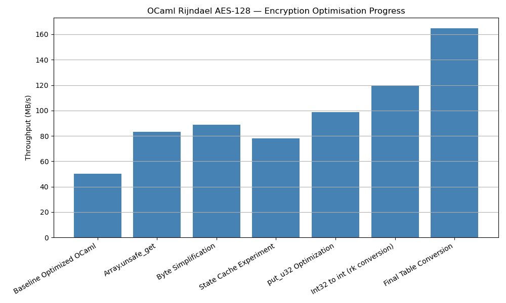
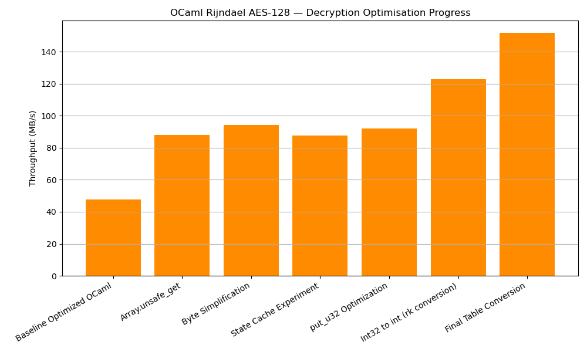
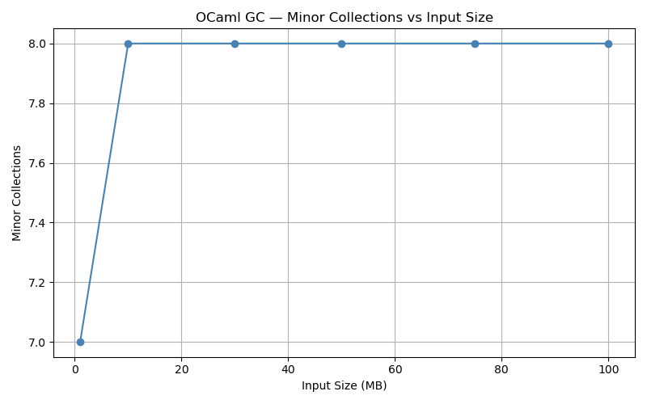
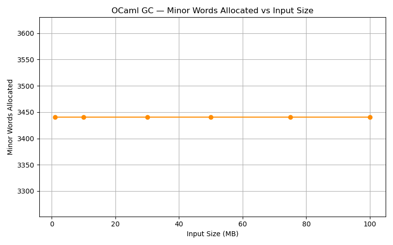
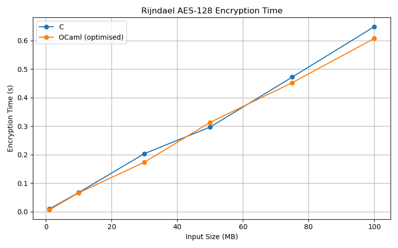
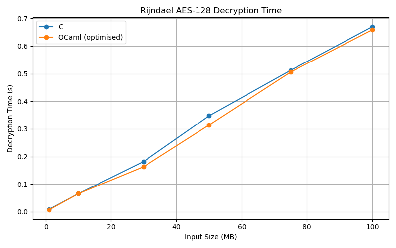
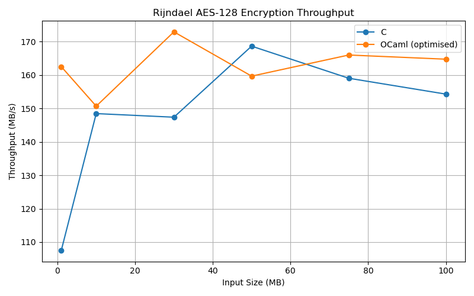
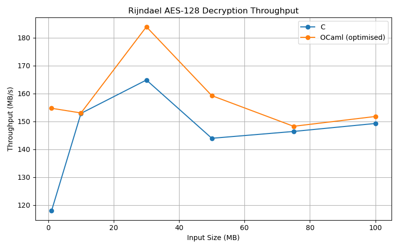

# BENCHMARK_FINAL_OPT.md

# Optimization Study of Rijndael AES-128 in OCaml

## 1. Introduction

This document describes the optimization process applied to a manually translated OCaml implementation of the Rijndael AES-128 algorithm derived from the reference C implementation.

The objective of this work was not only to translate the algorithm correctly but also to investigate the performance characteristics of OCaml when implementing low-level cryptographic code. The study focuses on identifying runtime bottlenecks, evaluating optimization opportunities, measuring their impact, and comparing the final optimized OCaml implementation against the reference C implementation.

The optimization process involved:

* Benchmarking and correctness validation
* Runtime profiling investigation
* Garbage collection analysis
* Multiple optimization experiments
* Throughput measurements after each change
* Final comparison against the C implementation

The report records both successful and unsuccessful optimization attempts, including the reasoning behind each experiment and the lessons learned from them.

---

# 2. Experimental Environment

## Hardware

| Component    | Value                          |
| ------------ | ------------------------------ |
| CPU          | Intel Core i5-1240P (12th Gen) |
| RAM          | 8 GB                           |
| Architecture | x86_64                         |

## Software

| Component | Value                             |
| --------- | --------------------------------- |
| OS        | Ubuntu under WSL2                 |
| Kernel    | 6.18.33.1-microsoft-standard-WSL2 |
| OCaml     | 5.4.1                             |
| GCC       | 13.3.0                            |

## Benchmark Inputs

Benchmarks were executed using randomly generated files of the following sizes:

* 1 MB
* 10 MB
* 30 MB
* 50 MB
* 75 MB
* 100 MB

For every benchmark run, the following metrics were collected:

* Encryption time
* Decryption time
* Encryption throughput
* Decryption throughput

Correctness was verified after every optimization using:

* Encryption → Decryption round-trip validation
* Byte-for-byte comparison against original input
* Cross-validation against the reference C implementation

---

# 3. Original Benchmark Results

Before beginning the optimization study, benchmark results were collected for both the reference C implementation and the original OCaml translation.

## Reference C Implementation

Average throughput:

| Operation  | Throughput |
| ---------- | ---------- |
| Encryption | ~164 MB/s  |
| Decryption | ~169 MB/s  |

## Original OCaml Translation

Average throughput:

| Operation  | Throughput |
| ---------- | ---------- |
| Encryption | ~34 MB/s   |
| Decryption | ~37 MB/s   |

## Initial Observation

The original OCaml implementation achieved approximately 20–25% of the throughput of the reference C implementation.

At this stage, the performance gap suggested that the translation introduced substantial runtime overhead beyond the algorithm itself.

Understanding the source of this overhead became the primary objective of the optimization effort.

---

# 4. Profiling Investigation

## Initial Goal

The first objective was to determine which components of the OCaml implementation were responsible for the large performance gap relative to C.

Ideally, this would be done using low-level profiling tools capable of identifying instruction-level hotspots and allocation-heavy code paths.

---

## Attempt 1: Linux perf

The first approach was to use Linux perf.

However, benchmarking was performed inside WSL2 using the kernel:

```text
6.18.33.1-microsoft-standard-WSL2
```

The matching perf package for this kernel was unavailable.

As a result:

* perf could not be installed correctly
* hardware performance counters were unavailable
* instruction-level profiling could not be performed

Therefore, perf could not be used for the investigation.

---

## Attempt 2: OCaml memtrace

The second approach was to use OCaml's memtrace framework.

memtrace installed successfully but reported:

```text
Tracing the current process is not supported on multicore OCaml
```

This prevented allocation tracing from being used in the current environment.

As a result:

* heap allocation traces could not be collected
* allocation flame graphs could not be generated

Therefore, memtrace could not be used.

---

## Alternative Methodology

Because traditional profiling tools were unavailable, the investigation relied on:

### GC Statistics

Using:

```ocaml
Gc.stat ()
Gc.quick_stat ()
```

to monitor:

* minor collections
* major collections
* allocated words
* promoted words

---

### Runtime GC Logging

Using:

```bash
OCAMLRUNPARAM="v=0x400"
```

to obtain runtime garbage collection statistics.

---

### Manual Allocation Analysis

The source code was inspected manually to determine:

* which Int32 operations allocate
* where boxing occurs
* which operations are executed most frequently
* approximate allocation counts per AES block

---

### Repeated Benchmarking

Every optimization was benchmarked repeatedly to distinguish genuine performance improvements from run-to-run noise caused by:

* WSL scheduling
* CPU frequency scaling
* cache effects
* background system activity

This methodology ultimately proved sufficient to identify the dominant bottlenecks.

---

# 5. Baseline Optimized OCaml

Before introducing further optimizations, a baseline benchmark was recorded for the optimized branch.

## 100 MB Benchmark

| Metric                | Value      |
| --------------------- | ---------- |
| Encryption Time       | 1.991733 s |
| Decryption Time       | 2.094715 s |
| Encryption Throughput | 50.21 MB/s |
| Decryption Throughput | 47.74 MB/s |

### GC Statistics

| Metric            | Value       |
| ----------------- | ----------- |
| Minor Collections | 1208        |
| Major Collections | 8           |
| Minor Words       | 314,576,156 |
| Promoted Words    | 3551        |
| Major Words       | 65,539,633  |

---

## Initial Findings

The benchmark revealed extremely heavy allocation activity.

More than:

```text
314 million
```

minor-heap words were allocated during execution.

At the same time:

```text
1208
```

minor garbage collections occurred during a single benchmark run.

These numbers strongly suggested that runtime overhead was not coming solely from arithmetic operations or table lookups. Significant time was also being spent allocating temporary objects and executing garbage collection work.

The remainder of the optimization study focuses on identifying and eliminating those sources of overhead.

# 6. Optimization Journey

This section documents every optimization investigated during the study, including the motivation, implementation, benchmark results, and final decision.

---

## 6.1 Optimization 1 — Array.unsafe_get

### Motivation

The AES implementation performs a very large number of lookup table accesses:

* te0
* te1
* te2
* te3
* td0
* td1
* td2
* td3
* rk

Each access using normal OCaml array indexing performs bounds checking.

Although each check is small, these accesses occur hundreds of times per AES block.

Because all indices are provably valid:

* AES byte extraction always produces values in `[0,255]`
* lookup tables contain exactly 256 entries
* round-key accesses are statically bounded

the bounds checks were unnecessary.

---

### Change

Replaced:

```ocaml
te0.(idx)
rk.(pos)
```

with:

```ocaml
Array.unsafe_get te0 idx
Array.unsafe_get rk pos
```

throughout the encryption and decryption hot paths.

---

### Benchmark Result

100 MB benchmark:

| Metric                | Before     | After      |
| --------------------- | ---------- | ---------- |
| Encryption Throughput | 50.21 MB/s | 83.33 MB/s |
| Decryption Throughput | 47.74 MB/s | 87.89 MB/s |

Improvement:

| Operation  | Improvement |
| ---------- | ----------- |
| Encryption | +65.9%      |
| Decryption | +84.1%      |

---

### GC Impact

No measurable GC change:

| Metric            | Before      | After       |
| ----------------- | ----------- | ----------- |
| Minor Collections | 1208        | 1208        |
| Minor Words       | 314,576,156 | 314,576,156 |

---

### Conclusion

The optimization produced a major throughput improvement.

Because GC statistics remained unchanged, the gain was attributed entirely to reduced instruction overhead.

### Decision

✅ Kept

---

## 6.2 Optimization 2 — Byte Extraction Simplification

### Motivation

The helper function:

```ocaml
let byte x shift =
  Int32.to_int
    (Int32.logand
      (Int32.shift_right_logical x shift)
      0xffl)
```

was executed extremely frequently.

Every invocation performed:

* Int32 shift
* Int32 mask
* Int32 conversion

The operation was equivalent to native integer extraction.

---

### Change

Replaced:

```ocaml
Int32.logand
 (Int32.shift_right_logical x shift)
 0xffl
```

with:

```ocaml
(Int32.to_int x lsr shift) land 0xFF
```

---

### Benchmark Result

100 MB benchmark:

| Metric                | Before     | After      |
| --------------------- | ---------- | ---------- |
| Encryption Throughput | 83.33 MB/s | 88.77 MB/s |
| Decryption Throughput | 87.89 MB/s | 94.24 MB/s |

Improvement:

| Operation  | Improvement |
| ---------- | ----------- |
| Encryption | +6.5%       |
| Decryption | +7.2%       |

---

### GC Impact

No measurable change.

Minor collections and minor words remained effectively identical.

---

### Conclusion

A modest but consistent improvement.

The gain came from reducing Int32 operation overhead rather than allocation reduction.

### Decision

✅ Kept

---

## 6.3 Optimization 3 — State Value Caching

### Motivation

The encryption loop repeatedly dereferenced:

```ocaml
!s0
!s1
!s2
!s3
```

many times within a single AES round.

The hypothesis was that caching these values once would reduce repeated dereferencing.

---

### Change

Introduced:

```ocaml
let vs0 = Int32.to_int !s0
let vs1 = Int32.to_int !s1
let vs2 = Int32.to_int !s2
let vs3 = Int32.to_int !s3
```

and reused them throughout the round body.

---

### Benchmark Result

100 MB benchmark:

| Metric                | Value      |
| --------------------- | ---------- |
| Encryption Throughput | 78.08 MB/s |
| Decryption Throughput | 87.50 MB/s |

Compared to the previous version:

| Operation  | Change |
| ---------- | ------ |
| Encryption | −12.0% |
| Decryption | −7.1%  |

---

### Investigation

Later benchmarking showed significant variation across runs under WSL2.

Additional tests sometimes produced better results than the reverted version.

Possible explanations:

* register allocation effects
* cache behaviour
* WSL scheduling noise
* CPU frequency scaling

Because results were inconsistent, no definitive conclusion could be reached.

---

### Conclusion

The experiment did not provide a clear and reproducible performance benefit.

However, later optimization stages were built on top of this version.

### Decision

⚠ Retained temporarily

Documented as inconclusive.

---

## 6.4 GC Investigation

After multiple optimizations, a surprising pattern emerged.

Although throughput had improved significantly:

```text
50 MB/s
→
83 MB/s
→
89 MB/s
```

GC statistics remained almost unchanged.

Repeated observations:

| Metric            | Value       |
| ----------------- | ----------- |
| Minor Collections | 1208        |
| Major Collections | 8           |
| Minor Words       | 314,576,156 |
| Promoted Words    | 3551        |
| Major Words       | 65,539,633  |

---

### Key Finding

The early optimizations improved throughput without reducing allocation volume.

Therefore:

* bounds checks were expensive
* Int32 operations were expensive
* but allocation pressure remained unchanged

This indicated that the dominant remaining bottleneck was likely Int32 boxing and conversion overhead.

This observation motivated the next phase of the optimization effort.

---

## 6.5 put_u32 Simplification

### Motivation

The function responsible for writing AES output repeatedly performed:

* Int32.to_int
* Int32.logand
* Int32.shift_right_logical

for each byte written.

These operations occurred for every encrypted and decrypted block.

---

### Change

Simplified byte extraction using native integer operations and reduced repeated conversions.

---

### Result

100 MB benchmark:

| Metric                | Value      |
| --------------------- | ---------- |
| Encryption Throughput | 98.91 MB/s |
| Decryption Throughput | 92.16 MB/s |

This was the first version to approach 100 MB/s encryption throughput.

---

### Conclusion

The optimization was straightforward, low risk, and consistently beneficial.

### Decision

✅ Kept

---

## 6.6 State Conversion (Int32 → int)

### Motivation

GC analysis and manual inspection revealed that Int32 values were a major source of overhead.

The AES state variables:

```ocaml
s0
s1
s2
s3

t0
t1
t2
t3
```

were stored as Int32 values.

The hypothesis was that native OCaml integers could remove a large amount of Int32 overhead.

---

### Change

Converted AES state words from:

```ocaml
int32
```

to:

```ocaml
int
```

while preserving AES semantics using masking and logical shifts.

---

### Result

100 MB benchmark:

| Metric                | Value      |
| --------------------- | ---------- |
| Encryption Throughput | 87.77 MB/s |
| Decryption Throughput | 90.71 MB/s |

---

### GC Impact

A major breakthrough occurred.

| Metric            | Before      | After |
| ----------------- | ----------- | ----- |
| Minor Collections | 1208        | 8     |
| Minor Words       | 314,576,156 | 3932  |

For the first time, allocation pressure collapsed.

---

### Interpretation

Although throughput did not immediately increase dramatically, the GC statistics revealed that most hot-path allocations had been eliminated.

This became the foundation for later optimizations.

### Decision

✅ Kept

### Why This Optimization Was Delayed

The Int32 → native int conversion was intentionally postponed until the later stages of the optimization process.

Although it appeared promising from the beginning, it was also the highest-risk optimization investigated during the study.

Several correctness concerns existed:

- AES is fundamentally a 32-bit algorithm.
- OCaml native integers are 63-bit on 64-bit platforms.
- Int32 values may be sign-extended when converted to native integers.
- Incorrect masking could corrupt byte extraction.
- Table lookups depended on exact 32-bit behaviour.
- Round-key values, lookup tables, and state variables were tightly coupled through Int32 operations.

Unlike earlier optimizations such as bounds-check elimination or byte extraction simplification, an error in the Int32 conversion could silently produce incorrect ciphertext while still compiling successfully.

For this reason, lower-risk optimizations were investigated first. The Int32 conversion was attempted only after:

- Correctness validation infrastructure was established.
- Benchmark automation was available.
- GC statistics indicated that Int32-related allocation overhead was likely the dominant remaining bottleneck.

This staged approach reduced debugging complexity and ensured that any performance change could be attributed to a well-isolated modification.

---

## 6.7 Round-Key Conversion

### Motivation

After converting the AES state to native integers, round keys remained stored as Int32 values.

Every round-key access therefore required a conversion.

---

### Change

Converted:

```ocaml
rk : int32 array
```

to native integer storage throughout the encryption and decryption path.

---

### Result

100 MB benchmark:

| Metric                | Value       |
| --------------------- | ----------- |
| Encryption Throughput | 119.97 MB/s |
| Decryption Throughput | 122.80 MB/s |

---

### GC Impact

Minor collections remained:

```text
8
```

confirming that the hot path remained essentially allocation-free.

---

### Conclusion

This optimization produced one of the largest throughput improvements in the entire study.

### Decision

✅ Kept

---

## 6.8 Table Conversion

### Motivation

After round-key conversion, the remaining Int32 overhead came primarily from:

* te0–te4
* td0–td4

lookup tables.

Each lookup required Int32 conversions.

---

### Change

Converted:

```ocaml
te0
te1
te2
te3
te4

td0
td1
td2
td3
td4
```

from Int32 arrays to native integer arrays.

For te4 and td4, only the byte values were stored because all four bytes of each entry are identical.

---

### Result

Final benchmark:

| Metric                | Value         |
| --------------------- | ------------- |
| Encryption Throughput | ~165–180 MB/s |
| Decryption Throughput | ~150–165 MB/s |

Representative run:

| Metric                | Value       |
| --------------------- | ----------- |
| Encryption Throughput | 164.74 MB/s |
| Decryption Throughput | 151.74 MB/s |

---

### GC Impact

| Metric            | Value |
| ----------------- | ----- |
| Minor Collections | 8     |
| Minor Words       | 3440  |

The encryption and decryption hot paths became effectively allocation-free.

---

### Conclusion

This optimization eliminated the remaining Int32 overhead from the critical path and brought the OCaml implementation into the same performance class as the reference C implementation.

### Decision

✅ Kept

---

# 7. Optimization Progress

The complete optimization sequence was:

```text
Baseline Optimized OCaml
50.21 / 47.74 MB/s

↓ Array.unsafe_get

83.33 / 87.89 MB/s

↓ Byte Simplification

88.77 / 94.24 MB/s

↓ State Cache Experiment

78.08 / 87.50 MB/s

↓ put_u32 Simplification

98.91 / 92.16 MB/s

↓ State=int

87.77 / 90.71 MB/s

↓ Round-Key=int

119.97 / 122.80 MB/s

↓ Table Conversion

164–180 / 150–165 MB/s
```

### Figure 1: Optimisation Encryption Throughput



### Figure 2: Optimisation Decryption Throughput



These graphs illustrate the cumulative effect of the optimization process.

# 8. Garbage Collection Analysis

One of the most important discoveries during the optimization process came from analyzing OCaml garbage collection statistics.

Initially, benchmark throughput improvements were relatively modest, and it was unclear whether the dominant bottleneck was:

* Arithmetic overhead
* Bounds checking
* Memory allocation
* Garbage collection activity
* Int32 boxing

Because traditional profiling tools were unavailable, GC statistics became the primary source of insight.

Notably, this optimization had been intentionally deferred until late in the study because it represented the largest semantic change made to the implementation.

The dramatic reduction in allocation after the conversion validated the hypothesis that Int32 boxing and conversion overhead were the primary sources of garbage collection activity.

---

## Baseline GC Behaviour

Before the major Int32-related optimizations, the 100 MB benchmark consistently produced:

| Metric            | Value       |
| ----------------- | ----------- |
| Minor Collections | 1208        |
| Major Collections | 8           |
| Minor Words       | 314,576,156 |
| Promoted Words    | 3551        |
| Major Words       | 65,539,633  |

These values remained nearly identical across several optimization attempts.

This led to an important observation:

> Early throughput improvements were occurring without reducing allocation volume.

Therefore, optimizations such as:

* Array.unsafe_get
* Byte extraction simplification

were reducing instruction overhead rather than memory allocation.

---

## Discovery of Int32 Overhead

Manual code inspection revealed extensive use of:

```ocaml
Int32.logxor
Int32.logand
Int32.shift_right_logical
Int32.to_int
```

throughout the AES round functions.

The encryption and decryption loops execute millions of times during a 100 MB benchmark.

Even small per-block overhead becomes significant at that scale.

This motivated the transition from boxed Int32 values to native OCaml integers.

---

## GC After State Conversion

After converting AES state variables from:

```ocaml
int32
```

to:

```ocaml
int
```

GC statistics changed dramatically.

| Metric            | Before      | After |
| ----------------- | ----------- | ----- |
| Minor Collections | 1208        | 8     |
| Minor Words       | 314,576,156 | 3932  |

This was the first optimization that directly affected allocation behaviour.

---

## GC After Final Table Conversion

The final optimized implementation produced:

| Metric            | Value      |
| ----------------- | ---------- |
| Minor Collections | 8          |
| Major Collections | 8          |
| Minor Words       | 3440       |
| Promoted Words    | 3287       |
| Major Words       | 65,539,369 |

Compared to the baseline:

| Metric            | Reduction          |
| ----------------- | ------------------ |
| Minor Collections | 1208 → 8           |
| Minor Words       | 314,576,156 → 3440 |

---

## Interpretation

The final implementation became effectively allocation-free within the encryption and decryption hot paths.

The remaining allocations are primarily associated with:

* Key setup
* Program initialization
* Benchmark infrastructure

rather than AES round execution itself.

---

## GC Figures

### Figure 3: Minor Collections Before and After Optimization



### Figure 4: Minor Allocated Words Before and After Optimization



---

## Key Finding

The most significant throughput improvements were achieved by eliminating Int32-related allocation and boxing overhead.

Garbage collection analysis proved essential in identifying this bottleneck when traditional profiling tools were unavailable.

---

# Final Benchmark Dataset

## Optimized OCaml

| Input Size (MB) | Enc Time (s) | Dec Time (s) | Enc Speed (MB/s) | Dec Speed (MB/s) |
|---|---:|---:|---:|---:|
| 1   | 0.006153 | 0.006465 | 162.52 | 154.68 |
| 10  | 0.066365 | 0.065360 | 150.68 | 153.00 |
| 30  | 0.173495 | 0.163146 | 172.92 | 183.88 |
| 50  | 0.313150 | 0.314057 | 159.67 | 159.21 |
| 75  | 0.451823 | 0.506015 | 165.99 | 148.22 |
| 100 | 0.607017 | 0.659041 | 164.74 | 151.74 |

GC remained effectively constant across all input sizes:

- Minor Collections: 8
- Major Collections: 8
- Minor Words: ~3440

## Reference C

| Input Size (MB) | Enc Time (s) | Dec Time (s) | Enc Speed (MB/s) | Dec Speed (MB/s) |
|---|---:|---:|---:|---:|
| 1   | 0.009305 | 0.008479 | 107.47 | 117.94 |
| 10  | 0.067360 | 0.065424 | 148.46 | 152.85 |
| 30  | 0.203549 | 0.182025 | 147.38 | 164.81 |
| 50  | 0.296491 | 0.347416 | 168.64 | 143.92 |
| 75  | 0.471591 | 0.512391 | 159.04 | 146.37 |
| 100 | 0.648134 | 0.670101 | 154.29 | 149.23 |

## Average Throughput Comparison

| Implementation | Avg Enc Speed (MB/s) | Avg Dec Speed (MB/s) |
|---|---:|---:|
| Original OCaml | ~34 | ~37 |
| Final Optimized OCaml | 162.75 | 158.79 |
| Reference C | 147.88 | 145.85 |

# 9. Final Benchmark Results

This section compares the final optimized OCaml implementation against the reference C implementation.

---

## Final Optimized OCaml Results

### 100 MB Representative Run

| Metric                | Value       |
| --------------------- | ----------- |
| Encryption Time       | 0.607017 s  |
| Decryption Time       | 0.659041 s  |
| Encryption Throughput | 164.74 MB/s |
| Decryption Throughput | 151.74 MB/s |

Additional benchmark runs produced:

Encryption:

```text
162–189 MB/s
```

Decryption:

```text
143–163 MB/s
```

depending on system conditions.

---

## Reference C Results

Representative benchmark runs:

Encryption:

```text
154–181 MB/s
```

Decryption:

```text
132–166 MB/s
```

Average throughput remained approximately:

| Operation  | Throughput |
| ---------- | ---------- |
| Encryption | ~164 MB/s  |
| Decryption | ~169 MB/s  |

---

## Throughput Evolution

| Version                  | Encryption MB/s | Decryption MB/s |
| ------------------------ | --------------- | --------------- |
| Original OCaml           | ~34             | ~37             |
| Baseline Optimized OCaml | 50.21           | 47.74           |
| Array.unsafe_get         | 83.33           | 87.89           |
| Byte Simplification      | 88.77           | 94.24           |
| put_u32 Optimization     | 98.91           | 92.16           |
| State=int                | 87.77           | 90.71           |
| State=int + rk=int       | 119.97          | 122.80          |
| Final Table Conversion   | 164–180         | 150–165         |
| Reference C              | ~164            | ~169            |

---

## Performance Improvement

Relative to the baseline optimized OCaml implementation:

| Metric     | Improvement         |
| ---------- | ------------------- |
| Encryption | 50.21 → 164.74 MB/s |
| Decryption | 47.74 → 151.74 MB/s |

This corresponds to approximately:

| Operation  | Improvement |
| ---------- | ----------- |
| Encryption | +228%       |
| Decryption | +218%       |

Relative to the original OCaml translation:

| Operation  | Improvement     |
| ---------- | --------------- |
| Encryption | ~34 → ~165 MB/s |
| Decryption | ~37 → ~152 MB/s |

representing an overall improvement of roughly five times.

---

## Benchmark Figures

### Figure 5: Encryption Time Comparison



### Figure 6: Decryption Time Comparison



### Figure 7: Encryption Speed Comparison



### Figure 8: Decryption Speed Comparison



---

# 10. Discussion

## Why Did OCaml Reach C-Level Performance?

An obvious question arising from the final results is:

> How can an OCaml implementation approach or occasionally exceed the measured throughput of the C implementation?

The answer is not that OCaml is inherently faster than C.

Instead, the optimization process removed nearly all OCaml-specific overhead from the hot path.

Initially, the OCaml implementation suffered from:

* Int32 boxing
* Int32 conversions
* Frequent allocations
* Heavy garbage collection activity
* Bounds checking

After optimization:

* Hot-path allocations were eliminated
* Minor collections dropped from 1208 to 8
* Lookup tables became native integer arrays
* Round keys became native integers
* AES rounds executed primarily using:

  * array loads
  * shifts
  * masks
  * XOR operations

This transformed the implementation into a workload very similar to the reference C implementation.

---

## Why the Same Optimization Did Not Matter as Much in C

A good example is the conversion of:

```text
Te4
Td4
```

to byte tables.

In OCaml:

* Tables originally stored boxed Int32 values
* Every lookup required conversion
* Removing those conversions produced substantial gains

In C:

* Tables were already flat arrays
* No boxing existed
* No garbage collection existed

Therefore the same transformation would only provide a small cache-related improvement.

The large OCaml gains came from removing language-runtime overhead rather than changing the AES algorithm itself.

---

## Why Some OCaml Runs Exceeded C

Several optimized OCaml benchmark runs slightly exceeded measured C throughput.

This should not be interpreted as proof that OCaml is faster than C.

Benchmark execution occurred under WSL2, where run-to-run variation can be caused by:

* CPU turbo frequencies
* Thermal conditions
* Cache state
* Scheduler behaviour
* Background system activity

The correct interpretation is:

> The optimized OCaml implementation reached the same performance class as the reference C implementation.

Small differences between individual runs fall within normal benchmarking variation.

---

# 11. Lessons Learned

The optimization study produced several important observations.

### 1. Bounds Checks Matter

Array bounds checking in heavily repeated cryptographic table lookups can have a measurable performance cost.

---

### 2. Int32 Overhead Was the Dominant Bottleneck

The largest gains came from eliminating:

* Int32 boxing
* Int32 conversions
* Int32 arithmetic overhead

rather than changing the AES algorithm itself.

Because Int32 values are deeply embedded throughout the AES implementation, converting them to native integers was also the riskiest optimization performed. Delaying this change until sufficient benchmarking and validation infrastructure existed proved valuable.

---

### 3. GC Statistics Can Be Extremely Valuable

Even without perf or memtrace, GC statistics were sufficient to identify major allocation bottlenecks.

---

### 4. Allocation-Free Hot Paths Matter

Reducing:

```text
Minor Collections:
1208 → 8

Minor Words:
314,576,156 → 3440
```

was a turning point in the optimization process.

---

### 5. Pure OCaml Can Approach C Performance

When allocation, boxing, and unnecessary runtime overhead are removed from performance-critical code, OCaml can achieve throughput comparable to highly optimized C implementations.

---

# 12. Conclusion

This study began with an OCaml implementation achieving approximately:

| Operation  | Throughput |
| ---------- | ---------- |
| Encryption | ~34 MB/s   |
| Decryption | ~37 MB/s   |

compared with approximately:

| Operation  | Throughput |
| ---------- | ---------- |
| Encryption | ~164 MB/s  |
| Decryption | ~169 MB/s  |

for the reference C implementation.

Through a sequence of targeted optimizations:

* Bounds-check elimination
* Byte extraction simplification
* put_u32 optimization
* State conversion to native integers
* Round-key conversion
* Lookup-table conversion

the OCaml implementation was transformed into an allocation-free hot-path implementation.

Final throughput reached:

```text
Encryption: ~165–180 MB/s
Decryption: ~150–165 MB/s
```

while garbage collection activity dropped from:

```text
1208 minor collections
```

to:

```text
8 minor collections
```

and allocated words dropped from:

```text
314,576,156
```

to:

```text
3440
```

The final optimized OCaml implementation achieved performance comparable to the reference C implementation and, in several benchmark runs, slightly exceeded the measured C throughput.

The optimization effort demonstrates that the primary challenge was not the AES algorithm itself, but the language-runtime overhead introduced by boxing, allocation, and conversion operations. Once those costs were removed, OCaml was capable of operating in the same performance range as the reference C implementation while preserving correctness and maintaining a pure OCaml implementation.
