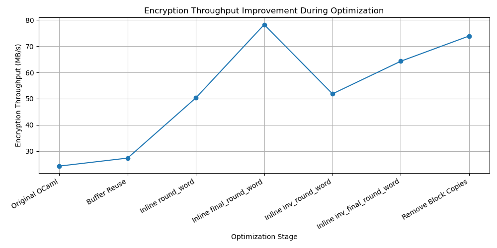
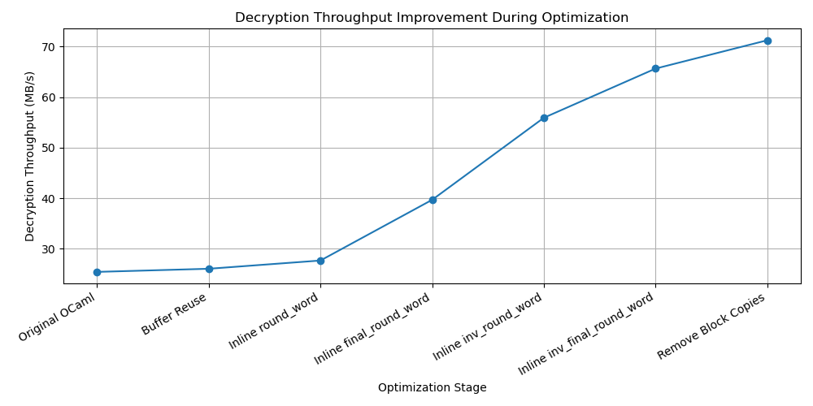
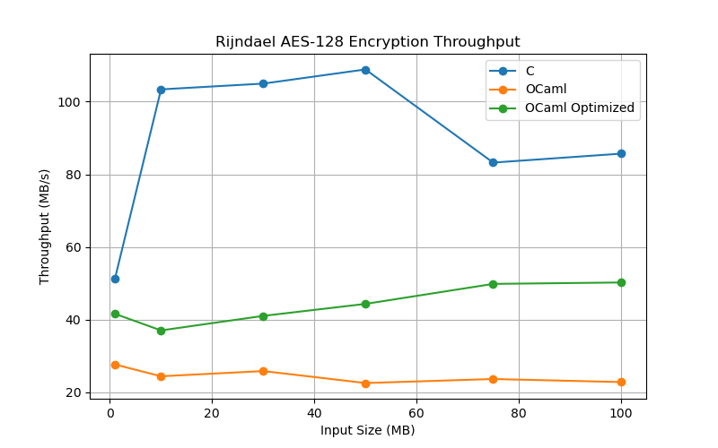
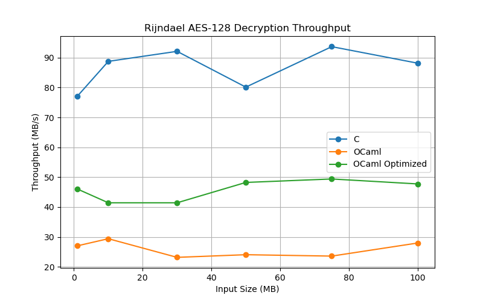
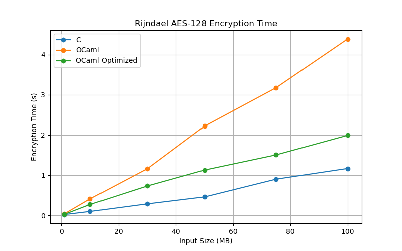
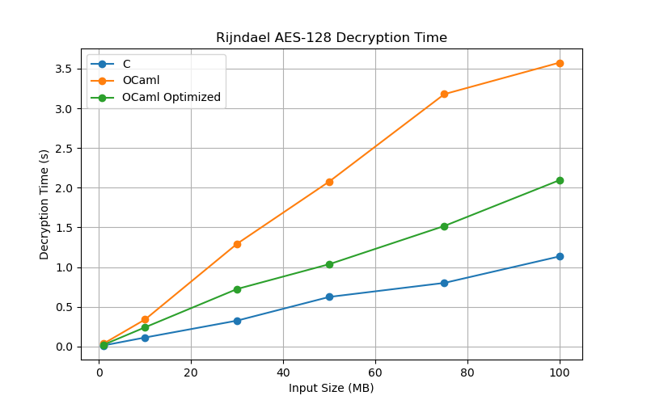

# Benchmark Analysis: Optimizing Rijndael AES-128 in OCaml

## Overview

This document presents the optimization study performed on a manually translated OCaml implementation of the Rijndael AES-128 reference algorithm.

The objectives of this study were:

* Identify performance bottlenecks in the OCaml implementation.
* Apply targeted optimizations while preserving correctness.
* Measure the impact of each optimization.
* Compare the optimized OCaml implementation against both the original OCaml implementation and the reference C implementation.
* Analyze the remaining performance gap between OCaml and C.

All benchmarks were executed on the same machine using identical benchmark inputs.

---

## Benchmark Environment

* Execution Environment: Ubuntu 24.04.4 LTS (WSL2)
* Compiler: GCC 13.3.0
* OCaml Version: 5.4.1
* Processor: 12th Gen Intel(R) Core(TM) i5-1240P
* CPU Cores: 8 Physical Cores, 16 Threads
* AES Variant: Rijndael AES-128
* Block Size: 128 bits (16 bytes)
* Key Size: 128 bits
* Number of Rounds: 10

---

## Benchmark Inputs

The benchmark suite evaluates performance on the following input sizes:

* 1 MB
* 10 MB
* 30 MB
* 50 MB
* 75 MB
* 100 MB

The following metrics are collected:

* Encryption Time (seconds)
* Decryption Time (seconds)
* Encryption Throughput (MB/s)
* Decryption Throughput (MB/s)

---

## Validation Methodology

Correctness was verified throughout the optimization process to ensure that performance improvements did not alter algorithmic behavior.

### AES Test Vector Validation

The implementation was validated using standard AES-128 encryption and decryption test vectors.

### Cross Validation Against C

Outputs generated by the OCaml implementation were compared against outputs produced by the reference C implementation.

The results matched exactly.

### Round-Trip Validation

For benchmark inputs:

* Encrypt plaintext
* Decrypt ciphertext
* Compare recovered plaintext with original plaintext

The recovered plaintext matched the original input in all validation tests.

### Validation of Non-Multiple-of-16 Inputs

Additional temporary tests were performed using padding to verify correctness for inputs whose lengths were not multiples of the AES block size.

These tests were used solely for validation purposes and were not part of the optimization measurements.

### Key Validation

The original OCaml benchmark implementation used a fixed AES-128 key consisting entirely of zero bytes.

During optimization, the benchmark was updated to use the same `key.txt` file used by the reference C implementation.

This ensured that both implementations were benchmarked using identical key material.

---

## Optimization History

The following table summarizes the throughput observed during development after each optimization stage.

| Optimization Stage          | Encryption Throughput (MB/s) | Decryption Throughput (MB/s) |
| --------------------------- | ---------------------------: | ---------------------------: |
| Original OCaml              |                        24.27 |                        25.42 |
| Buffer Reuse                |                        27.32 |                        26.04 |
| Inline round_word           |                        50.31 |                        27.67 |
| Inline final_round_word     |                        78.27 |                        39.68 |
| Inline inv_round_word       |                        51.84 |                        55.91 |
| Inline inv_final_round_word |                        64.29 |                        65.64 |
| Remove Block Copies         |                        73.92 |                        71.24 |

*Note:** These measurements were collected during development immediately after each optimization was applied in order to estimate its individual impact. The final benchmark results presented later in this document were generated from a separate benchmark run using a unified benchmarking framework for the C, original OCaml, and optimized OCaml implementations. As a result, some optimization-stage throughput values may differ from the final benchmark measurements due to factors such as CPU frequency scaling, cache state, runtime conditions, and background system activity.

---

## Optimization Progress Graphs

### Encryption Optimization Progress

### Decryption Optimization Progress

---

## Description of Optimizations

### Buffer Reuse

The original benchmark allocated temporary buffers inside encryption and decryption loops.

The optimized version reused previously allocated buffers, reducing allocation overhead and decreasing pressure on the OCaml runtime system.

### Inlining round_word

The encryption path originally relied on repeated calls to the helper function `round_word`.

This helper was manually inlined into the encryption loop.

Benefits:

* Reduced function-call overhead.
* Increased opportunities for compiler optimization.
* Reduced runtime dispatch cost.

### Inlining final_round_word

The final AES encryption round used a separate helper function.

Inlining the logic removed additional function-call overhead from every encrypted block.

### Inlining inv_round_word

The same strategy was applied to the decryption path.

Inlining `inv_round_word` reduced overhead during inverse AES rounds.

### Inlining inv_final_round_word

The final inverse AES round was similarly inlined.

This optimization significantly improved decryption throughput.

### Offset-Based Block Processing

The original implementation repeatedly created temporary blocks and copied data using:

* `Bytes.sub`
* `Bytes.blit`

The optimized implementation processes blocks using offsets directly into the original buffers.

Benefits:

* Eliminates unnecessary block copies.
* Reduces allocation overhead.
* Improves cache locality.
* Reduces memory traffic.

---

## Why Optimization Measurements Differ From Final Benchmark Results

The optimization-history measurements were collected during development to estimate the impact of individual code changes.

The final benchmark tables presented later in this document were generated using a fresh benchmark run after all optimizations had been applied.

Small differences between development measurements and final benchmark measurements are expected because of:

* CPU frequency scaling
* Cache state
* Background system activity
* Runtime state of the OCaml system
* Operating system scheduling effects

Therefore:

* Optimization-history results should be interpreted as relative improvement measurements.
* Final benchmark tables should be treated as the authoritative benchmark results.

---

## Final Benchmark Results

### Reference C Implementation

| Size (MB) | Enc Time (s) | Dec Time (s) | Enc Speed (MB/s) | Dec Speed (MB/s) |
| --------- | -----------: | -----------: | ---------------: | ---------------: |
| 1         |     0.019465 |     0.012969 |            51.38 |            77.11 |
| 10        |     0.096734 |     0.112667 |           103.38 |            88.76 |
| 30        |     0.285796 |     0.325702 |           104.97 |            92.11 |
| 50        |     0.459261 |     0.623914 |           108.87 |            80.14 |
| 75        |     0.901242 |     0.800590 |            83.22 |            93.68 |
| 100       |     1.167201 |     1.134433 |            85.68 |            88.15 |

---

### Original OCaml Implementation

| Size (MB) | Enc Time (s) | Dec Time (s) | Enc Speed (MB/s) | Dec Speed (MB/s) |
| --------- | -----------: | -----------: | ---------------: | ---------------: |
| 1         |     0.036202 |     0.037000 |            27.62 |            27.03 |
| 10        |     0.410226 |     0.339992 |            24.38 |            29.41 |
| 30        |     1.161775 |     1.294668 |            25.82 |            23.17 |
| 50        |     2.220208 |     2.077885 |            22.52 |            24.06 |
| 75        |     3.173918 |     3.178836 |            23.63 |            23.59 |
| 100       |     4.387719 |     3.575698 |            22.79 |            27.97 |

---

### Optimized OCaml Implementation

| Size (MB) | Enc Time (s) | Dec Time (s) | Enc Speed (MB/s) | Dec Speed (MB/s) |
| --------- | -----------: | -----------: | ---------------: | ---------------: |
| 1         |     0.024057 |     0.021723 |            41.57 |            46.04 |
| 10        |     0.270227 |     0.241354 |            37.01 |            41.43 |
| 30        |     0.731526 |     0.724134 |            41.01 |            41.43 |
| 50        |     1.128417 |     1.036473 |            44.31 |            48.24 |
| 75        |     1.505516 |     1.518121 |            49.82 |            49.40 |
| 100       |     1.991733 |     2.094715 |            50.21 |            47.74 |

---

## Benchmark Graphs

### Encryption Throughput

### Decryption Throughput

### Encryption Time

### Decryption Time

---

## Performance Analysis

### Encryption Performance

For the 100 MB benchmark:

| Implementation  | Encryption Throughput (MB/s) |
| --------------- | ---------------------------: |
| C               |                        85.68 |
| Original OCaml  |                        22.79 |
| Optimized OCaml |                        50.21 |

The optimized implementation achieves approximately:

* 2.20× higher encryption throughput than the original OCaml implementation.
* Approximately 58.6% of the throughput achieved by the reference C implementation.

### Decryption Performance

For the 100 MB benchmark:

| Implementation  | Decryption Throughput (MB/s) |
| --------------- | ---------------------------: |
| C               |                        88.15 |
| Original OCaml  |                        27.97 |
| Optimized OCaml |                        47.74 |

The optimized implementation achieves approximately:

* 1.71× higher decryption throughput than the original OCaml implementation.
* Approximately 54.2% of the throughput achieved by the reference C implementation.

---

## Remaining Performance Gap Relative to C

Despite substantial improvements, a performance gap remains between OCaml and C.

Several factors contribute to this difference.

### Runtime Overhead

The C implementation executes directly as optimized machine code with minimal runtime overhead.

The OCaml implementation executes within the OCaml runtime environment.

### Garbage Collection

OCaml uses automatic memory management.

Although allocations were reduced significantly during optimization, garbage collection overhead still exists.

### Bounds Checking

OCaml performs safety checks on array accesses.

The reference C implementation performs direct memory access without equivalent runtime checks.

### Memory Representation

The OCaml runtime uses different internal representations and abstractions than low-level C code.

These abstractions introduce additional execution overhead.

### Compiler Optimization Differences

The reference Rijndael implementation was originally designed and optimized for C compilers such as GCC and Clang.

The OCaml compiler cannot always generate machine code with the same low-level optimizations for table-driven cryptographic workloads.

---

## Conclusion

This optimization study demonstrates that substantial performance improvements can be achieved in a manually translated OCaml implementation of Rijndael AES-128 without sacrificing correctness.

Key findings:

- Correctness was preserved throughout all optimization stages.
- Additional validation was performed on non-block-aligned inputs using temporary padding-based tests.
- The optimized OCaml benchmark uses the same key material as the reference C benchmark.
- Multiple targeted optimizations significantly improved throughput.
- The largest gains were obtained by eliminating helper-function call overhead and reducing unnecessary memory allocations and data copies.
- Encryption throughput improved from approximately 24 MB/s to over 50 MB/s.
- Decryption throughput improved from approximately 25 MB/s to nearly 48 MB/s.
- The optimized implementation more than doubled overall performance compared to the original translation.

While a measurable gap remains relative to the reference C implementation, the study shows that careful reduction of allocation overhead, function-call overhead, and unnecessary data movement can substantially narrow that gap while maintaining algorithmic equivalence and correctness.
