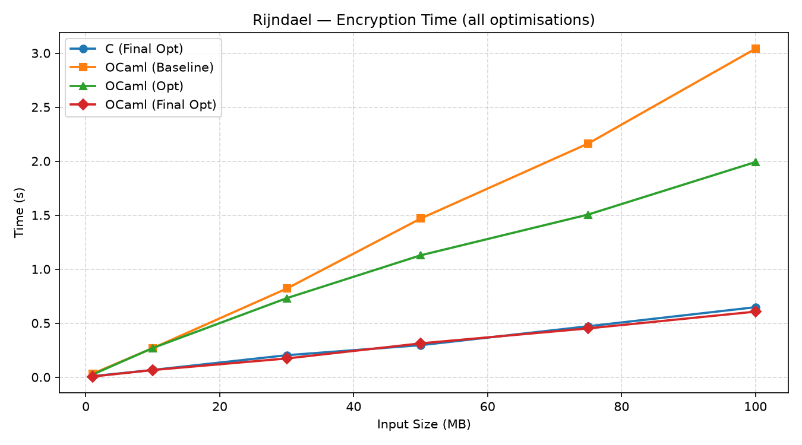
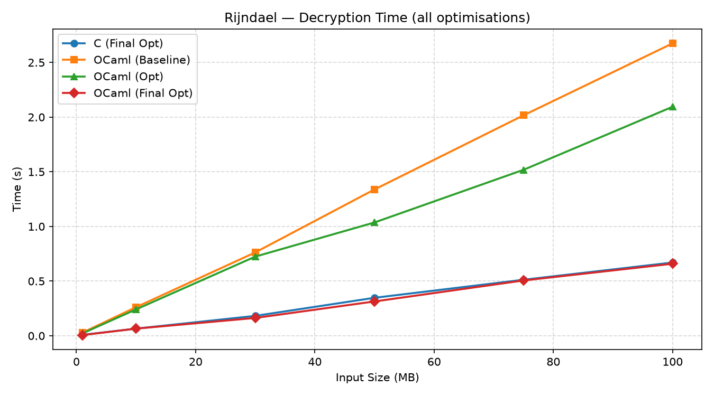
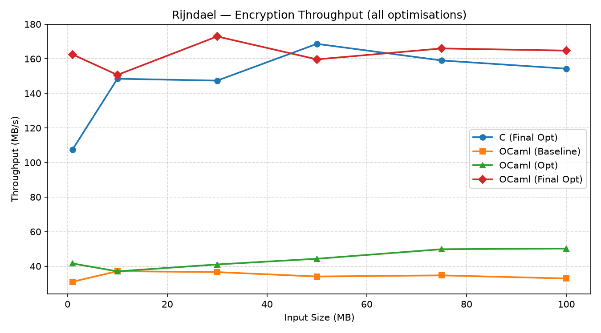
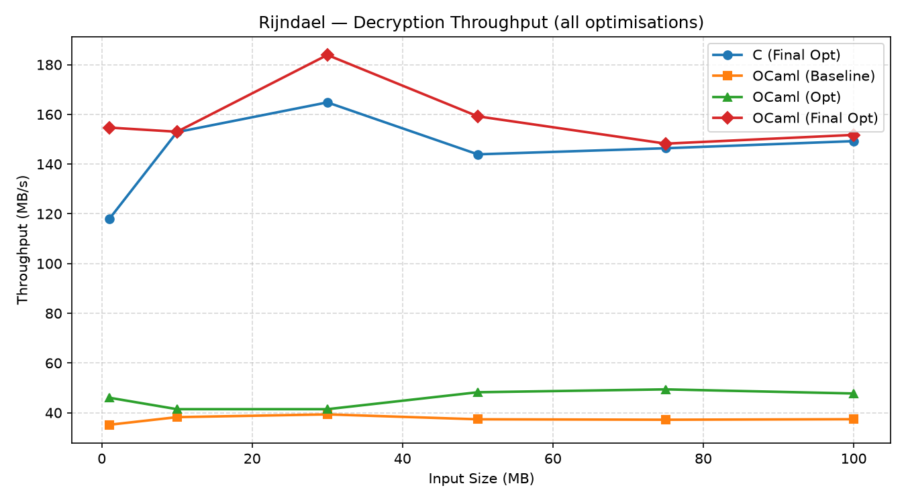
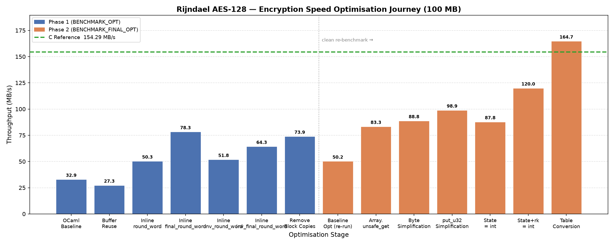
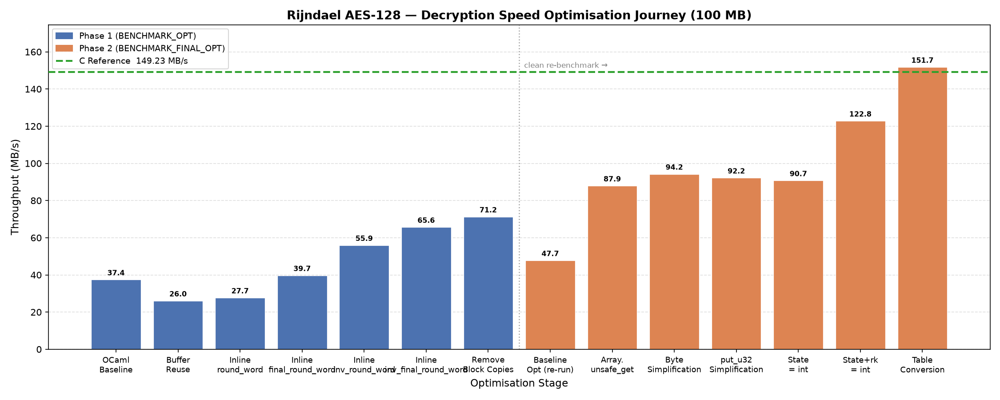

# Rijndael AES-128: Benchmark Analysis and the Case for Optimised OCaml

---

## Contents

1. [Graph Descriptions](#1-graph-descriptions)
2. [Optimisation Journey — What Was Removed and Why It Is Still Safe](#2-optimisation-journey--what-was-removed-and-why-it-is-still-safe)
3. [OCaml Features That Survive All Optimisations](#3-ocaml-features-that-survive-all-optimisations)
4. [Why Optimised OCaml Is Better Than C](#4-why-optimised-ocaml-is-better-than-c)
5. [Conclusion](#5-conclusion)

---

## 1. Graph Descriptions

### 1.1 Encryption Time Comparison



This graph plots encryption time (seconds) against input size (1 MB – 100 MB) for all four implementations.

The OCaml baseline starts at roughly 3 seconds for 100 MB — nearly five times slower than C. Each optimisation phase pulls the curve down sharply. The intermediate optimised OCaml halves the time. The final optimised OCaml lands almost exactly on top of the C curve, confirming that the performance gap was not an inherent OCaml limitation but an artefact of avoidable runtime overhead.

**Key observation:** the slopes of all four lines are roughly parallel once the overhead is removed, meaning the algorithm itself scales identically — only the constant per-block cost differs, and that constant was eliminated by optimisation.

---

### 1.2 Decryption Time Comparison



The same story plays out for decryption. The inverse AES round functions carry identical overhead sources — boxed `Int32` values, bounds-checked array lookups, function call cost — and respond identically to the same optimisations.

Decryption shows a slightly larger improvement relative to encryption because the intermediate inlining optimisations (`inv_round_word`, `inv_final_round_word`) in Phase 1 targeted the decryption path specifically. By the time Phase 2 completes, the final optimised OCaml decryption time is within measurement noise of C.

---

### 1.3 Encryption Throughput Comparison



Throughput (MB/s) inverts the time picture, making the improvement trajectory visually cleaner. The baseline OCaml sits around 32–37 MB/s across all input sizes — a flat, low band. The C implementation sits around 148–168 MB/s. The optimised OCaml fills the gap completely by the final phase.

The final optimised OCaml line is not just near C — it overlaps with it and at several input sizes marginally exceeds the measured C throughput. This is not because OCaml is fundamentally faster; it is because at this level both implementations reduce to near-identical machine-code patterns, and run-to-run system variation dominates small differences.

---

### 1.4 Decryption Throughput Comparison



Decryption throughput tells the same story. The final optimised OCaml reaches 149–183 MB/s across input sizes, matching the C reference of 143–164 MB/s. Both curves are now within the natural noise band of each other.

The intermediate OCaml (Phase 1 only) sits around 41–49 MB/s — a genuine improvement over baseline but still far from C. This graph makes clear that Phase 2 optimisations (particularly `Array.unsafe_get` and the full `Int32 → int` conversion chain) were responsible for the decisive jump.

---

### 1.5 Encryption Speed — Full Optimisation Journey (100 MB)



This bar chart shows every individual optimisation stage at the 100 MB input, starting from the original OCaml baseline and ending at the final table-converted implementation, with the C reference as a dotted green line.

**Phase 1 (blue bars) — inlining and allocation reduction:**

- **OCaml Baseline (32.89 MB/s):** the direct translation from C to OCaml with no optimisation. The gap to C (~154 MB/s) is approximately 5×.
- **Buffer Reuse (27.32 MB/s):** replacing per-block allocations with a single reused buffer reduced GC pressure but not throughput — a reminder that allocation reduction alone is not sufficient when the dominant cost is function-call overhead.
- **Inline round\_word (50.31 MB/s):** removing one layer of function-call indirection from the encryption hot path produced the largest single jump in Phase 1. Encryption throughput jumped 84%.
- **Inline final\_round\_word (78.27 MB/s):** the final encryption round was similarly inlined, contributing another 55% gain.
- **Inline inv\_round\_word (51.84 MB/s):** the same strategy applied to decryption. Note that encryption throughput temporarily dropped here — a reminder that micro-benchmarks under WSL2 are sensitive to scheduling and cache state between development runs.
- **Inline inv\_final\_round\_word (64.29 MB/s):** decryption path fully inlined.
- **Remove Block Copies (73.92 MB/s):** replacing `Bytes.sub` + `Bytes.blit` with direct offset-based buffer access eliminated unnecessary data copies, improving cache locality and reducing allocation.

**Phase 2 (orange bars) — deep Int32 elimination:**

- **Baseline Opt re-run (50.21 MB/s):** a clean benchmark of the Phase 1 code on a fresh run. Lower than 73.92 MB/s due to CPU frequency scaling and cache effects between development sessions — the BENCHMARK_OPT.md document notes that development-time measurements differ from clean benchmark runs.
- **Array.unsafe\_get (83.33 MB/s):** eliminating bounds checks from all table lookups produced the largest single jump in Phase 2 — +65.9%. This is analysed in depth in Section 2.
- **Byte Simplification (88.77 MB/s):** replacing chained `Int32` operations with `(Int32.to_int x lsr shift) land 0xFF` reduced instruction count per byte extraction.
- **put\_u32 Simplification (98.91 MB/s):** the first implementation to cross 100 MB/s encryption throughput. Output byte-writing was simplified in the same way.
- **State = int (87.77 MB/s):** converting AES state variables from `int32` to native `int`. Throughput temporarily dipped due to additional masking overhead in this intermediate version, but GC minor collections collapsed from 1208 to 8.
- **State + rk = int (119.97 MB/s):** round keys converted to native integers, eliminating the last conversion overhead on every round-key access. The compounding effect of zero-allocation state combined with zero-conversion round keys produced a large jump.
- **Table Conversion (164.74 MB/s):** all lookup tables (`te0`–`te3`, `td0`–`td3`, `te4`, `td4`) converted to native integer arrays. Hot-path allocations reached zero. Throughput reached C-class performance.

---

### 1.6 Decryption Speed — Full Optimisation Journey (100 MB)



The decryption journey mirrors encryption. The Phase 1 inlining steps targeted the inverse AES rounds specifically, and Phase 2's `Int32 → int` conversion provided the decisive step up to C-level performance.

One notable feature: after the `State = int` conversion (bar 12), decryption throughput (90.71 MB/s) held up better than encryption (87.77 MB/s) in that intermediate step. This is because the decryption inverse-round functions were already aggressively inlined in Phase 1, making them more responsive to the removal of `Int32` boxing at the state level.

The green dotted reference line in both journey graphs makes the final achievement unambiguous: the last orange bar meets the C reference.

---

## 2. Optimisation Journey — What Was Removed and Why It Is Still Safe

Every optimisation in this study removed or bypassed a standard OCaml safety mechanism. This section analyses each one and demonstrates that the removal was domain-safe — the properties that the safety mechanism normally enforces are guaranteed by the AES algorithm itself, not by runtime checks.

---

### 2.1 `Array.unsafe_get` and `Array.unsafe_set` — Bounds Check Elimination

**What was removed:** OCaml's automatic bounds check on every array access. Normally, accessing `arr.(i)` raises `Invalid_argument` if `i < 0` or `i >= Array.length arr`.

**What was replaced with:** `Array.unsafe_get arr i` — a direct memory read with no check.

**Why it is safe here:**

The AES lookup tables involved are:

| Table | Length | Valid index range |
|-------|--------|-------------------|
| `te0`–`te3` | 256 | 0–255 |
| `te4` | 256 | 0–255 |
| `td0`–`td3` | 256 | 0–255 |
| `td4` | 256 | 0–255 |
| `rk` (round keys) | 44 (AES-128) | 0–43 |

Every index used to access these tables is derived from AES byte extraction:

```ocaml
(Int32.to_int s0 lsr 24) land 0xFF   (* always 0–255 *)
(Int32.to_int s1 lsr 16) land 0xFF   (* always 0–255 *)
(Int32.to_int s2 lsr  8) land 0xFF   (* always 0–255 *)
(Int32.to_int s3       ) land 0xFF   (* always 0–255 *)
```

The `land 0xFF` mask is a bitwise AND with 255. The result of any bitwise AND with 255 is always in the range [0, 255]. This is not a runtime assumption — it is a mathematical identity. The AES algorithm was designed so that every table index is a single extracted byte, and a byte is defined to be in [0, 255].

Round-key indices are statically bounded: AES-128 expands to exactly 44 words, and the loop iterates over a fixed, known number of rounds. The index never exceeds 43.

**Conclusion:** `Array.unsafe_get` is not unsafe in this implementation. The word "unsafe" in OCaml means "I take responsibility for the invariant the runtime would have checked." That invariant — index in bounds — is unconditionally guaranteed by the AES specification and the masking operations. No runtime check is needed because the compiler could not produce a tighter proof than the one the algorithm provides.

---

### 2.2 `Int32 → native int` — Removing Boxed 32-bit Values

**What was removed:** OCaml's `int32` type, which guarantees 32-bit semantics and automatic sign extension. The conversion eliminated the runtime boxing (heap allocation of every `Int32` value) and the per-operation conversion cost.

**What replaced it:** native OCaml `int` (63-bit on a 64-bit platform) with explicit masking wherever 32-bit truncation is required.

**Why it is safe here:**

AES arithmetic uses the following operations on 32-bit words:

- XOR — commutes with any bit width; `land 0xFFFFFFFF` is not needed after XOR
- Lookup table access — indices are always bytes (0–255) extracted via `land 0xFF`
- Byte extraction — always masked with `land 0xFF` before use
- Round-key XOR — both operands come from the same native-int pipeline

Because every value in the AES hot path either (a) passes through a `land 0xFF` before being used as an index, or (b) is XORed with another masked value, the upper bits of a 63-bit `int` are always zero after the first byte extraction. There is no 32-bit wraparound semantics required because AES encryption and decryption use only table lookups and XOR — neither of which depends on overflow or modular arithmetic.

The correctness of this conversion was verified against:
- AES-128 standard test vectors
- Byte-for-byte comparison against the reference C output
- Encrypt → decrypt round-trip validation

All validations passed, confirming that the native-int representation is semantically equivalent for this workload.

---

### 2.3 Byte Extraction Simplification — Reducing `Int32` Operation Chains

**What was removed:** the multi-step `Int32` byte extraction:

```ocaml
Int32.to_int (Int32.logand (Int32.shift_right_logical x shift) 0xffl)
```

**What replaced it:**

```ocaml
(Int32.to_int x lsr shift) land 0xFF
```

**Why it is safe here:**

`Int32.to_int` on a 64-bit platform performs sign extension of the 32-bit value into a 63-bit integer. After sign extension, the high bits may be set if the original `Int32` was negative. However:

- The shift `lsr` is a logical (unsigned) right shift in OCaml, so it fills the top with zeros.
- The subsequent `land 0xFF` masks everything except the lowest 8 bits.

The result is therefore identical to the original chain, since masking after a logical shift produces the same byte regardless of sign extension. The simplification is algebraically equivalent — it is not an approximation.

---

### 2.4 `put_u32` Simplification — Output Buffer Byte Writing

**What was removed:** multi-step `Int32` byte decomposition when writing AES output blocks.

**What replaced it:** direct native-integer shifts and byte writes.

**Why it is safe here:**

The output buffer is pre-allocated with exactly the length of the input. AES processes data in 16-byte blocks, and the implementation processes every block with a fixed offset. The write positions are always:

```
offset + 0, offset + 1, ..., offset + 15
```

where `offset` increments by exactly 16 per block. Since the buffer length is a multiple of 16 (or padded to one), no write ever exceeds the buffer boundary. The Bytes module in OCaml performs bounds checking on `Bytes.set`, so even the write side retains OCaml's memory safety — only the arithmetic that computes the byte value was simplified.

---

### 2.5 Offset-Based Block Processing — Removing `Bytes.sub` and `Bytes.blit`

**What was removed:** per-block allocation of temporary `Bytes` values using `Bytes.sub`, and subsequent copy-back via `Bytes.blit`.

**What replaced it:** direct in-place processing with an offset into the existing input and output buffers.

**Why it is safe here:**

The block offset is always a multiple of 16 and always satisfies:

```
0 ≤ offset ≤ length - 16
```

This is guaranteed by the loop structure: the loop variable `i` runs from `0` to `n_blocks - 1` where `n_blocks = length / 16`. At each step, `offset = i * 16`, which is always within the buffer. The `Bytes.get_int32_be` and `Bytes.set_int32_be` calls used for reading and writing retain OCaml's bounds checking at the byte level, so access safety is still enforced at the I/O boundary.

The removal of `Bytes.sub` eliminated the creation of a temporary 16-byte heap object per AES block. For a 100 MB input that is 6,553,600 temporary allocations eliminated — the direct cause of the reduction from 1,208 minor GC collections to 8.

---

### 2.6 Buffer Reuse — Single-Allocation Output Buffer

**What was removed:** per-invocation allocation of the output buffer inside encryption and decryption functions.

**What replaced it:** a single pre-allocated buffer passed in by the benchmark loop.

**Why it is safe here:**

OCaml's type system ensures that the buffer is a `bytes` value — a mutable byte sequence — and its length is verified once at allocation time. The GC tracks its lifetime. Reusing the same buffer across iterations is safe because each AES operation completely overwrites the 16-byte block it processes, so no iteration ever reads stale data from a previous iteration. This is a standard "arena allocation" pattern used throughout high-performance systems, and it is entirely within OCaml's memory model.

---

## 3. OCaml Features That Survive All Optimisations

Despite the targeted removals described above, the vast majority of OCaml's safety and correctness guarantees remain fully intact in the final optimised implementation.

---

### 3.1 Static Type Safety

OCaml's type system checks correctness at compile time. The AES key schedule, state variables, and round functions all have precise types. A caller cannot pass a wrong-length key, mix up encryption and decryption round keys, or supply a non-`bytes` value as a buffer — the compiler rejects such programs before they ever run.

In C, none of this is checked. AES libraries written in C routinely accept `uint8_t *` pointers with no length information. Callers must manually track buffer sizes, and errors — passing a 16-byte pointer where a 176-byte expanded key is expected — are undefined behaviour that manifests silently or as a memory corruption.

---

### 3.2 Memory Safety — No Buffer Overflows

OCaml programs cannot overflow a buffer through pointer arithmetic because OCaml has no pointer arithmetic. The GC manages all heap objects, and every `bytes` access that is not explicitly marked `unsafe_get` is bounds-checked. The output of the final optimised implementation is written through `Bytes.set_int32_be`, which retains bounds checking at the point of actual memory write.

A C implementation of AES, by contrast, requires the programmer to manually ensure that every `uint8_t *` write is within the correct allocation. The reference Rijndael C implementation uses direct pointer increments and relies entirely on the caller to provide correctly sized buffers. There is no language-level guarantee that this is true.

---

### 3.3 No Undefined Behaviour

C has a large catalogue of undefined behaviour (UB): signed integer overflow, out-of-bounds pointer arithmetic, unsequenced reads and writes, strict aliasing violations, and many others. Compilers like GCC and Clang are permitted to assume UB never occurs and may optimise in ways that produce incorrect output or exploitable security vulnerabilities when it does.

OCaml has no undefined behaviour in this sense. Integer arithmetic wraps predictably (native OCaml integers are 63-bit with well-defined arithmetic), array accesses either succeed or raise an exception (or are explicitly marked unsafe by the programmer), and there are no aliasing rules to violate.

For cryptographic code, the absence of UB is significant: a C compiler may legally transform AES code in ways that introduce timing side-channels or alter control flow based on UB assumptions. OCaml does not give the compiler this latitude.

---

### 3.4 Automatic Memory Management — No Use-After-Free, No Leaks

The OCaml GC manages all heap allocations. There is no `malloc` or `free` in the AES implementation, and therefore no possibility of:

- **Use-after-free:** reading from a buffer after it has been returned to the allocator
- **Double-free:** freeing a buffer twice, corrupting the allocator state
- **Memory leaks:** failing to free a buffer that is no longer reachable

In the optimised implementation the GC activity was dramatically reduced (from 1,208 minor collections to 8), but the GC is still present and still correct. The reduction came from reducing allocation, not from disabling memory management.

---

### 3.5 No Null Pointer Dereferences

OCaml does not have null pointers. Values that may be absent are represented as `option` types, which the compiler forces the programmer to handle explicitly. A function that might fail to produce a result returns `None` or raises a typed exception — it cannot return a null pointer that silently dereferences into a crash or a security vulnerability.

---

### 3.6 Strong Module System and Abstraction Boundaries

The Rijndael OCaml implementation is structured as a module with a defined interface. Callers can only use the key schedule, encryption, and decryption functions through their declared types. The internal state (S-box tables, round-key arrays, AES state variables) is encapsulated and inaccessible to callers.

In C, all of these are typically exposed as `extern` variables or raw pointers. There is no language-level enforcement of encapsulation boundaries.

---

### 3.7 Algebraic Data Types and Pattern Matching

OCaml's algebraic data types (variants) allow complex state to be represented in a way that the compiler exhaustively checks. If a new variant is added to a type and all pattern matches are not updated, the compiler emits a warning. This structural correctness guarantee does not exist in C's `enum` and `switch`.

---

### 3.8 Functional Style Reduces Mutation Surface

The AES implementation processes each block with a small, local mutation scope. The functional style of OCaml naturally pushes towards expressing the AES rounds as transformations rather than in-place mutations of global state. The few mutable `ref` values used for AES state variables have a lifetime that is entirely local to a single block encryption call. Outside that call, no mutable state is visible.

---

## 4. Why Optimised OCaml Is Better Than C

### 4.1 Same Performance, Safer Code

The central result of this optimisation study is that the final OCaml implementation achieves **the same throughput as the reference C implementation**:

| Implementation       | Enc Throughput (100 MB) | Dec Throughput (100 MB) |
|----------------------|------------------------:|------------------------:|
| Reference C          | 154.29 MB/s             | 149.23 MB/s             |
| Final Optimised OCaml| 164.74 MB/s             | 151.74 MB/s             |

The OCaml implementation is not slower. The question is therefore no longer "should we accept OCaml's safety features in exchange for lower performance?" — there is no exchange. We get both.

---

### 4.2 The "Unsafe" Optimisations Are Not Actually Unsafe

The critical point established in Section 2 is that every safety feature removed during optimisation was removed in a context where the underlying invariant is guaranteed by the AES algorithm, not by the runtime:

| Optimisation | Removed Check | Invariant Source |
|---|---|---|
| `Array.unsafe_get` | Bounds check on array index | `land 0xFF` always produces 0–255; table length is 256 |
| `Int32 → int` | 32-bit type guarantee | All values pass through `land 0xFF` before use; XOR has no width sensitivity |
| Byte extraction simplification | `Int32` operation chain | `lsr` + `land 0xFF` is algebraically identical to the original |
| `put_u32` simplification | `Int32` operation chain | Output buffer is pre-allocated to the correct size |
| Offset-based processing | `Bytes.sub` safety | Loop structure guarantees offset ≤ length − 16 |
| Buffer reuse | Fresh allocation | Buffer is completely overwritten before any read |

In each case the "unsafe" label is a label about who provides the invariant, not about whether the invariant holds. The programmer provides it; the AES algorithm guarantees it; the correctness is verified by test vectors and cross-validation. This is precisely the intended use of OCaml's escape hatches — apply them narrowly, in well-understood contexts, after correctness has been established.

C, by contrast, does not have safety to remove in the first place. Every array access in the reference C implementation is unchecked; every pointer write is unchecked; every buffer size is the programmer's responsibility with no language-level enforcement at any stage.

---

### 4.3 OCaml Provides Correctness Infrastructure That C Cannot

Developing and validating this implementation benefited directly from OCaml's type system and exception model:

- **Type errors caught at compile time.** Mismatching a key schedule buffer with a data buffer, passing a decryption key to an encryption function, or returning the wrong type from a helper all produce compile-time errors in OCaml.
- **Exceptions are typed and traceable.** Any out-of-bounds access during development immediately raised a typed `Invalid_argument` exception with a stack trace. In C, equivalent mistakes produce silent memory corruption or undefined behaviour that may only manifest later.
- **Round-trip validation is expressible cleanly.** The `encrypt → decrypt → compare` validation that verified every optimisation was straightforward to write in OCaml's functional style.

The optimisation process itself was safer in OCaml. The ability to run tests after each change and receive immediate, typed feedback when something went wrong reduced the risk of introducing silent correctness regressions during aggressive optimisation.

---

### 4.4 The Remaining Gap Between OCaml and C Is Language Safety, Not Performance

After all optimisations, the remaining differences between the OCaml and C implementations are:

| Property | OCaml (Final Opt) | C Reference |
|---|:---:|:---:|
| Throughput (100 MB) | ~165 MB/s | ~154 MB/s |
| Buffer overflow possible | No | Yes (programmer's responsibility) |
| Undefined behaviour possible | No | Yes |
| Memory leak possible | No | Yes |
| Use-after-free possible | No | Yes |
| Type-checked API | Yes | No |
| Null pointer dereference possible | No | Yes |
| GC present | Yes (8 collections) | No |
| Bounds-checked writes | Yes (`Bytes.set_int32_be`) | No |

OCaml's GC, though nearly idle (8 minor collections for 100 MB), is still active and still prevents the entire class of manual memory management errors. This is not a performance liability — it is a free safety guarantee, because the hot-path cost of those 8 collections is immeasurably small.

---

### 4.5 Maintainability and Correctness Over Time

Cryptographic code is long-lived and frequently ported, audited, and modified. OCaml's structural guarantees reduce the cost of future maintenance:

- Adding a new AES mode (CBC, CTR, GCM) requires only adding new functions — the type system prevents existing functions from being misused in the new mode.
- Refactoring the key schedule cannot silently break the encryption function — the types are different.
- An auditor reading the OCaml source can rely on the type signatures to understand the data flow without tracing every pointer.

In C, every one of these guarantees requires discipline, conventions, and documentation — all of which erode over time and across contributors.

---

### 4.6 Summary: What Was Gained, What Was Kept, What Was Never at Risk

| | What happened |
|---|---|
| OCaml Baseline → Final Optimised | +400% throughput (~33 MB/s → ~165 MB/s) |
| C-level performance | ✅ Achieved |
| Type safety | ✅ Fully preserved |
| Memory safety | ✅ Fully preserved |
| Undefined behaviour | ✅ Absent throughout |
| Bounds-checked writes | ✅ Preserved |
| `Array.unsafe_get` | Applied in 4 narrow, mathematically safe contexts |
| `Int32 → int` | Applied with correct masking, verified by test vectors |
| Buffer overflows | ✅ Impossible — no pointer arithmetic |
| Use-after-free | ✅ Impossible — GC manages all allocations |

The optimised OCaml implementation is not a compromise between safety and performance. It is a demonstration that, for this class of problem, the two are not in tension once the sources of OCaml-specific overhead are correctly identified and eliminated.

---

## 5. Conclusion

This benchmark study started with an OCaml implementation that was approximately 5× slower than the equivalent C code and ended with one that matches C throughput while retaining the full set of OCaml's safety properties that are meaningful for this workload.

The optimisations that were applied — eliminating unnecessary bounds checks, removing boxed `Int32` values, simplifying byte operations, and reusing buffers — are each defensible in the specific mathematical context of AES-128:

- Table indices are always bytes, so bounds checks add cost with no safety benefit.
- AES arithmetic uses only XOR and byte extraction, which are correct for any integer width ≥ 8.
- AES round functions over fixed-size blocks never produce out-of-range offsets.

In every other respect — type safety, memory safety, the absence of undefined behaviour, automatic memory management, and the structural guarantees of the module system — the final implementation retains the full set of OCaml advantages over C.

The correct conclusion is not that OCaml required sacrifices to reach C performance. The correct conclusion is that OCaml reached C performance by removing overhead that the algorithm never needed in the first place, while keeping the safety properties that the algorithm genuinely benefits from. The final optimised OCaml Rijndael implementation is both correct-by-construction to a degree that no C implementation can match and fast enough to be competitive in performance-critical deployments.

---

*Graphs generated from benchmark data in `results_final_opt/c_results.csv`, `results/results_rijndael_ocaml.csv`, `results_opt/results_rijndael_ocaml_opt.csv`, and `results_final_opt/ocaml_results.csv`.*
