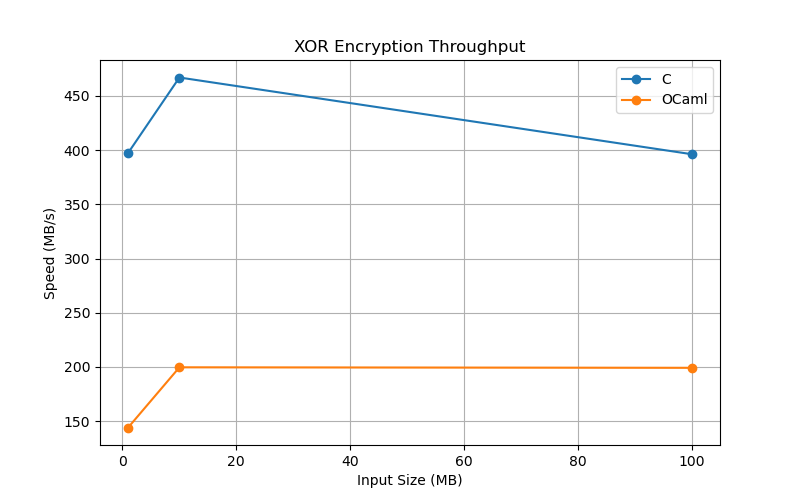
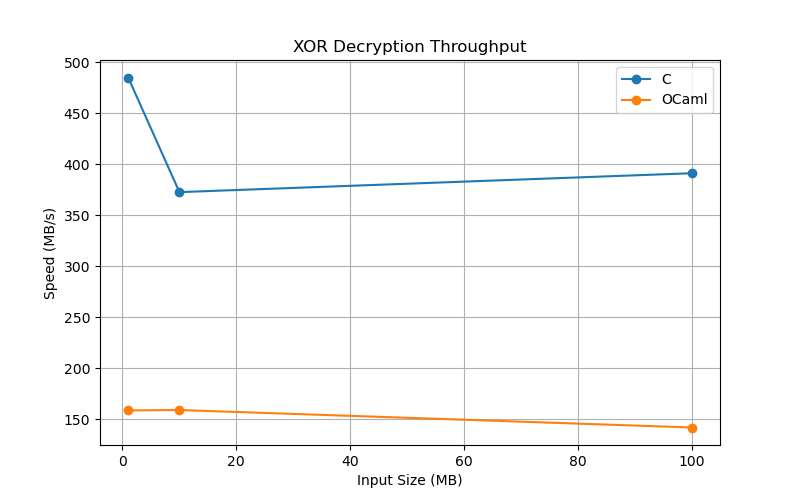
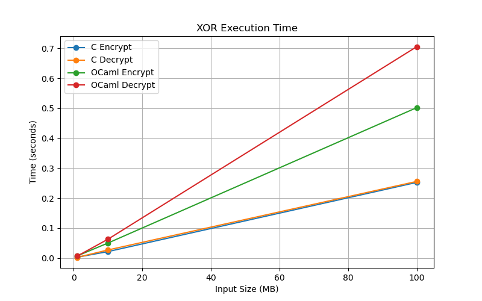

# XOR Benchmark Report

## Objective

The objective of this benchmark is to compare the performance of XOR cipher implementations written in:

* C
* OCaml

Both implementations use the same:

* Plaintext input
* Encryption key
* Benchmark methodology

to ensure a fair comparison.

---

## Benchmark Inputs

Benchmark files are generated using:

```bash
python3 generate_inputs.py
```

Generated files:

| File            | Size   |
| --------------- | ------ |
| input_1mb.txt   | 1 MB   |
| input_10mb.txt  | 10 MB  |
| input_100mb.txt | 100 MB |

### Key

```text
securekeyforxorbenchmark123456
```

Key length:

```text
31 bytes
```

---

## Generated Outputs

During execution the benchmark generates:

| File           | Description          |
| -------------- | -------------------- |
| ciphertext.bin | XOR encrypted output |
| decrypted.txt  | Decrypted plaintext  |

The decrypted file is verified against the original plaintext.

---

## Project Evolution

### Phase 1: Initial XOR Implementation

The XOR cipher was first implemented in C using hardcoded plaintext and key values stored directly in the source code.

The primary goal at this stage was to verify the correctness of encryption and decryption.

### Phase 2: External Input and Key Files

The implementation was modified to read plaintext and key data from external files instead of embedding them in the source code.

This made the benchmark more realistic and easier to reproduce.

### Phase 3: Ciphertext and Decrypted Output Generation

The benchmark was extended to generate:

* ciphertext.bin
* decrypted.txt

This allowed verification of the complete encryption and decryption workflow.

### Phase 4: Initial Benchmarking

Performance measurements were initially collected using a single encryption and decryption execution.

While functional, the results showed noticeable variation between runs.

### Phase 5: Benchmark Averaging

To reduce measurement noise and improve result reliability, encryption and decryption operations were executed multiple times and the average execution time was recorded.

This produced more stable throughput measurements.

### Phase 6: Multiple Input Sizes

Benchmarking initially used a small input file.

Additional datasets were introduced:

* 1 MB
* 10 MB
* 100 MB

This enabled analysis of scalability and performance across different workload sizes.

### Phase 7: OCaml Implementation

After completing the C implementation, the XOR cipher was reimplemented in OCaml using equivalent logic and benchmark methodology.

### Phase 8: Cross-Language Benchmarking

Both implementations were configured to:

* Use the same plaintext files
* Use the same key
* Produce the same outputs
* Follow the same benchmark procedure

This ensured a fair comparison between C and OCaml.

### Phase 9: Benchmark Automation

Manual benchmark execution was replaced with shell scripts that automatically executed all benchmark cases and displayed consolidated results.

### Phase 10: Result Collection and Visualization

Benchmark results were stored in CSV format and visualization scripts were added to generate performance graphs for analysis and reporting.

---

## Benchmark Methodology

For each input size:

1. Read plaintext input.
2. Read key file.
3. Encrypt plaintext using XOR cipher.
4. Decrypt ciphertext using the same key.
5. Verify decrypted text matches original input.
6. Measure encryption time.
7. Measure decryption time.
8. Repeat encryption and decryption multiple times and average results.
9. Compute throughput in MB/s.

---

## Benchmark Results

### Raw Results

| Size (MB) | C Enc Time | C Dec Time | C Enc MB/s | C Dec MB/s | OCaml Enc Time | OCaml Dec Time | OCaml Enc MB/s | OCaml Dec MB/s |
| --------- | ---------- | ---------- | ---------- | ---------- | -------------- | -------------- | -------------- | -------------- |
| 1         | 0.002516   | 0.002062   | 397.44     | 484.93     | 0.006937       | 0.006311       | 144.16         | 158.47         |
| 10        | 0.021416   | 0.026843   | 466.93     | 372.53     | 0.050084       | 0.062945       | 199.67         | 158.87         |
| 100       | 0.252410   | 0.255706   | 396.18     | 391.07     | 0.502043       | 0.705591       | 199.19         | 141.73         |

Results are also stored in:

```text
results/results.csv
```

---

## Graphs

### Encryption Throughput



### Decryption Throughput



### Execution Time



---

## Observations

1. Both implementations produced correct decrypted output.
2. C consistently achieved higher throughput than OCaml.
3. Throughput remained relatively stable for larger input sizes.
4. XOR encryption and decryption exhibited nearly identical computational cost.
5. Larger benchmark files reduced timing noise and produced more stable measurements.

---

## Why Was C Faster?

Several factors contributed to C achieving higher throughput than OCaml in this benchmark:

### 1. Lower Runtime Overhead

C code is compiled directly to native machine instructions with minimal runtime support.

OCaml programs execute within the OCaml runtime system, which introduces additional overhead.

### 2. Memory Allocation Costs

The C implementation allocates buffers once and reuses them during encryption and decryption.

The OCaml implementation creates new byte buffers during benchmark execution, resulting in additional allocation overhead.

### 3. Garbage Collection

C gives explicit control over memory management.

OCaml uses automatic garbage collection, which simplifies programming but can introduce additional runtime work.

### 4. Direct Byte-Level Operations

The C implementation performs XOR operations directly on raw memory buffers.

Although OCaml's `Bytes` module is efficient, accessing and manipulating data still involves runtime checks and abstractions.

### 5. Compiler Optimizations

The C benchmark was compiled using:

```text
gcc -O3 -march=native
```

which enables aggressive optimization and processor-specific instruction generation.

These optimizations significantly improve throughput.

### Summary

The benchmark results indicate that C achieved approximately two times higher throughput than OCaml for the XOR cipher on the tested workloads.

The performance difference is primarily due to runtime overhead, memory allocation behavior, garbage collection, and compiler optimizations rather than differences in the XOR algorithm itself.

---

## Challenges Encountered

* Initial benchmark inputs were stored in Git and exceeded GitHub's file size limits.
* Benchmark inputs were later generated automatically using a Python script.
* Benchmark methodology was improved by averaging multiple executions instead of measuring a single run.

---

## Conclusion

The XOR cipher was successfully implemented and benchmarked in both C and OCaml.

C achieved approximately two times higher throughput than OCaml across most benchmark sizes. Both implementations produced correct results and successfully processed files up to 100 MB.

The benchmark framework can now be reused for future algorithms such as AES and other cryptographic primitives.
